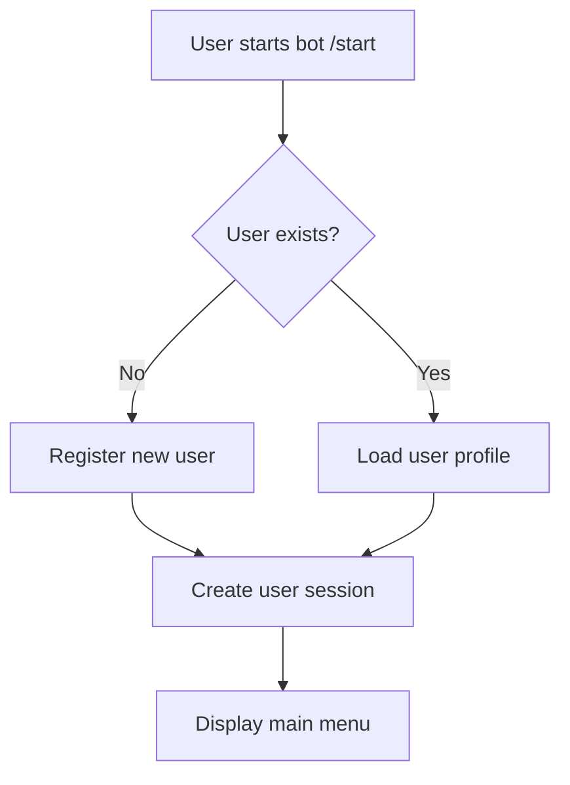
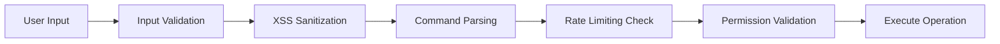
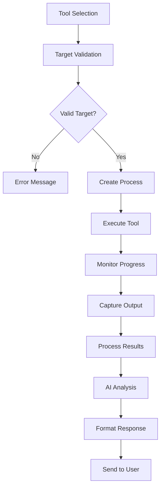
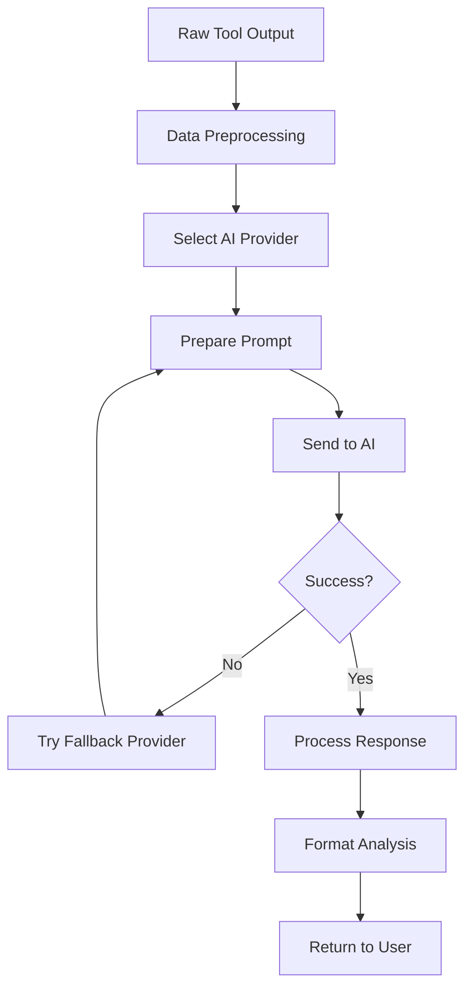
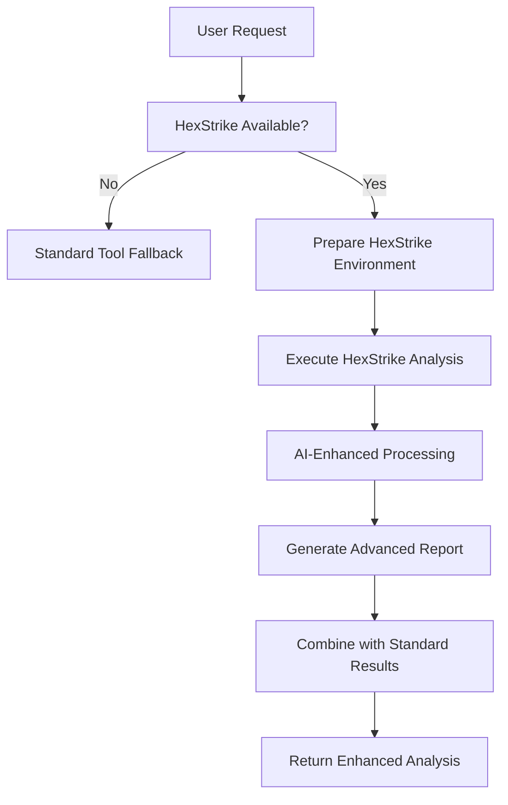
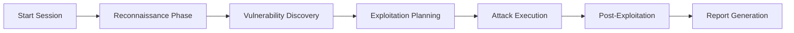
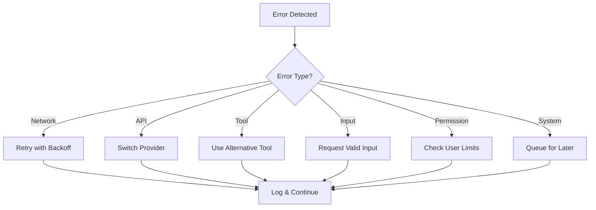

# 🚀 Jaeger AI - Complete Process Flow Documentation

## 📋 Table of Contents
1. [System Overview](#system-overview)
2. [Bot Initialization Process](#bot-initialization-process)
3. [User Interaction Flow](#user-interaction-flow)
4. [Security Tool Execution Process](#security-tool-execution-process)
5. [AI Analysis Pipeline](#ai-analysis-pipeline)
6. [HexStrike Integration Flow](#hexstrike-integration-flow)
7. [PentestGPT Integration Flow](#pentestgpt-integration-flow)
8. [Error Handling & Recovery](#error-handling--recovery)
9. [Data Flow Diagram](#data-flow-diagram)

## 🎯 System Overview

Jaeger AI is an ultimate cybersecurity platform that combines 141+ security tools with AI-powered analysis. The system operates as a Telegram bot that provides real-time penetration testing, vulnerability assessment, and security analysis capabilities.

### Core Components
- **Telegram Bot Interface** - User interaction layer
- **Security Tools Engine** - 141+ integrated tools
- **AI Analysis System** - Grok 4 Fast + DeepSeek + Gemini
- **HexStrike Integration** - Advanced AI-powered security testing
- **PentestGPT Integration** - GPT-4 powered penetration testing
- **Database Layer** - User management and scan history
- **Logging System** - Comprehensive activity tracking

## 🔄 Bot Initialization Process

### 1. Environment Setup
```
┌─ Load Environment Variables (.env)
├─ BOT_TOKEN (Telegram)
├─ GEMINI_API_KEY
├─ OPENROUTER_API_KEY (Grok 4 Fast)
├─ OPENROUTER_API_KEY_BACKUP (DeepSeek)
└─ Additional configuration variables
```

### 2. Dependency Loading
```
📦 Dependencies
├─ Telegraf (Telegram Bot Framework)
├─ Google Generative AI (Gemini)
├─ Node-fetch (HTTP requests)
├─ SQLite3 (Database)
├─ XSS & Validator (Security)
└─ User Management System
```

### 3. API Key Management
```
🔑 API Key Failover System
├─ Primary: Grok 4 Fast (x-ai/grok-beta)
├─ Secondary: DeepSeek (deepseek/deepseek-chat-v3.1:free)
└─ Tertiary: Gemini (Primary for basic operations)
```

### 4. Database Initialization
```
🗄️ Database Setup
├─ User registration table
├─ Scan history table
├─ Session management
└─ Statistics tracking
```

### 5. Security Tools Loading
```
🛠️ Security Tools Initialization
├─ Network Scanning (Nmap, Masscan, etc.)
├─ Web Application Testing (Nikto, Gobuster, etc.)
├─ Vulnerability Assessment (Nuclei, etc.)
├─ OSINT Tools (TheHarvester, etc.)
└─ Cloud Security Tools
```

## 👤 User Interaction Flow

### 1. User Registration & Authentication


### 2. Menu Navigation System
```
🎛️ Main Menu Options
├─ 🎯 Single Tool Execution
├─ 🚀 Multi-Tool Scanning
├─ 🧠 AI-Powered Analysis
├─ 🔴 HexStrike Operations
├─ 🤖 PentestGPT Mode
├─ 📊 Scan History
└─ ⚙️ Settings & Help
```

### 3. Command Processing Flow


## 🔧 Security Tool Execution Process

### 1. Tool Selection & Validation
```
🎯 Tool Execution Pipeline
├─ Parse user command/target
├─ Validate target (URL/IP/Domain)
├─ Select appropriate tool(s)
├─ Check user permissions
├─ Validate rate limits
└─ Prepare execution environment
```

### 2. Execution Phases


### 3. Process Management
```
⚙️ Process Control
├─ Spawn child process with timeout
├─ Monitor resource usage
├─ Handle process cancellation
├─ Capture stdout/stderr
├─ Clean up temporary files
└─ Log execution details
```

## 🧠 AI Analysis Pipeline

### 1. Multi-Provider Strategy
```
🤖 AI Provider Hierarchy
├─ Primary: Grok 4 Fast (Advanced analysis)
├─ Fallback: DeepSeek (Backup analysis)
└─ Emergency: Gemini (Basic analysis)
```

### 2. Analysis Process


### 3. Analysis Types
```
🔍 AI Analysis Categories
├─ Vulnerability Assessment
├─ Risk Scoring
├─ Remediation Suggestions
├─ False Positive Filtering
├─ Executive Summary
└─ Technical Deep Dive
```

## 🔴 HexStrike Integration Flow

### 1. HexStrike Initialization
```
🚀 HexStrike Setup
├─ Check HexStrike availability
├─ Validate configuration
├─ Prepare execution environment
└─ Initialize AI models
```

### 2. Execution Process


### 3. Advanced Features
```
⚡ HexStrike Capabilities
├─ AI-powered vulnerability detection
├─ Advanced payload generation
├─ Intelligent fuzzing
├─ Automated exploitation
├─ Real-time threat analysis
└─ Custom attack scenarios
```

## 🤖 PentestGPT Integration Flow

### 1. PentestGPT Mode Activation
```
🧠 PentestGPT Process
├─ User selects PentestGPT mode
├─ Initialize GPT-4 reasoning model
├─ Load penetration testing context
├─ Prepare interactive session
└─ Begin guided testing
```

### 2. Interactive Testing Flow


### 3. GPT-4 Reasoning Process
```
🎯 PentestGPT Decision Making
├─ Analyze current target state
├─ Identify potential attack vectors
├─ Plan step-by-step approach
├─ Execute planned actions
├─ Evaluate results
├─ Adapt strategy based on findings
└─ Generate comprehensive report
```

## ⚠️ Error Handling & Recovery

### 1. Error Classification
```
🚨 Error Types
├─ Network Errors (Connection issues)
├─ API Errors (AI provider failures)
├─ Tool Errors (Command execution failures)
├─ Input Errors (Invalid targets/commands)
├─ Permission Errors (Access denied)
└─ System Errors (Resource exhaustion)
```

### 2. Recovery Mechanisms


### 3. Graceful Degradation
```
🔄 Fallback Strategy
├─ AI Provider Failover
├─ Tool Alternative Selection
├─ Reduced Functionality Mode
├─ Error Message Customization
└─ Operation Retry Logic
```

## 📊 Data Flow Diagram

### Complete System Data Flow
```
📈 Data Movement
┌─ User Input (Telegram)
├─ Input Validation & Sanitization
├─ Command Processing
├─ Database Operations
├─ Tool Execution
├─ Result Processing
├─ AI Analysis
├─ Response Formatting
└─ User Output (Telegram)
```

### Security Considerations
```
🔒 Security Measures
├─ Input sanitization (XSS protection)
├─ Command injection prevention
├─ Rate limiting enforcement
├─ User permission validation
├─ Secure API key management
├─ Process isolation
├─ Output filtering
└─ Audit logging
```

## 🔄 Session Management

### 1. User Session Lifecycle
```
👤 Session States
├─ Initial - First bot interaction
├─ Authenticated - User verified
├─ Active - Performing operations
├─ Idle - No recent activity
├─ Limited - Rate limit reached
└─ Suspended - Violation detected
```

### 2. State Persistence
```
💾 Session Data
├─ User preferences
├─ Operation history
├─ Current scan progress
├─ Rate limit counters
├─ Active process tracking
└─ Error state management
```

## 📝 Logging & Monitoring

### 1. Log Categories
```
📋 Logging System
├─ INFO - General operations
├─ SUCCESS - Completed operations
├─ ERROR - Error conditions
├─ WARN - Warning conditions
├─ USER - User activities
├─ TOOL - Tool executions
├─ AI - AI interactions
└─ SECURITY - Security events
```

### 2. Monitoring Points
```
📊 Monitoring Metrics
├─ User activity levels
├─ Tool execution success rates
├─ AI provider response times
├─ Error frequency by type
├─ Resource utilization
├─ Security incident detection
└─ Performance bottlenecks
```

## 🎯 Future Enhancements

### Planned Improvements
```
🚀 Roadmap
├─ Advanced AI model integration
├─ Real-time collaboration features
├─ Enhanced visualization tools
├─ Mobile application development
├─ API endpoint creation
├─ Enterprise-grade scaling
└─ Advanced reporting dashboard
```

---

*This documentation provides a comprehensive overview of Jaeger AI's process flow. For specific implementation details, refer to the source code and additional technical documentation.*