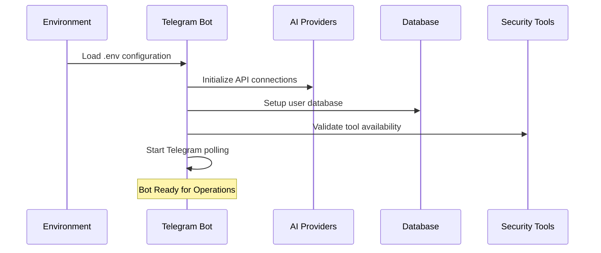

# 🔧 Jaeger AI - Tech Stack & Architecture Deep Dive

## 📋 Table of Contents
1. [Technology Stack Overview](#technology-stack-overview)
2. [Core Technologies](#core-technologies)
3. [AI & Machine Learning Stack](#ai--machine-learning-stack)
4. [Database & Storage](#database--storage)
5. [Security Framework](#security-framework)
6. [Integration Technologies](#integration-technologies)
7. [Development & Testing Tools](#development--testing-tools)
8. [Process Flow Technical Details](#process-flow-technical-details)
9. [Architecture Patterns](#architecture-patterns)
10. [Performance & Scalability](#performance--scalability)

## 🎯 Technology Stack Overview

Jaeger AI dibangun menggunakan modern technology stack yang dirancang untuk **cybersecurity**, **AI integration**, dan **high-performance bot operations**.

### 🏗️ Architecture Pattern
```
┌─────────────────┐    ┌─────────────────┐    ┌─────────────────┐
│   PRESENTATION  │    │     BUSINESS    │    │      DATA       │
│                 │    │                 │    │                 │
│ • Telegram Bot  │◄──►│ • AI Analysis   │◄──►│ • SQLite DB     │
│ • User Interface│    │ • Tool Manager  │    │ • File Storage  │
│ • Input Handler │    │ • Security Eng. │    │ • Session Cache │
└─────────────────┘    └─────────────────┘    └─────────────────┘
```

## 💻 Core Technologies

### 🟢 **Node.js Runtime Environment**
- **Version**: 18.0.0+
- **Purpose**: Server-side JavaScript execution
- **Why Chosen**:
  - Excellent for I/O intensive operations
  - Large ecosystem for security tools
  - Asynchronous processing capabilities
  - Native support for spawning system processes

### 📦 **NPM Package Management**
- **Dependencies**:
  - Production: 7 core packages
  - Development: 2 testing packages
- **Lock File**: `package-lock.json` untuk dependency consistency

### 🤖 **Telegraf Framework**
```javascript
const { Telegraf, Markup } = require('telegraf');

// Bot Configuration
bot.telegram.options = {
    handlerTimeout: 600000, // 10 minutes for long operations
    retryAfter: 1
};
```
- **Purpose**: Telegram Bot API wrapper
- **Features**:
  - Event-driven architecture
  - Middleware support
  - Keyboard markup handling
  - File upload capabilities
  - Error handling & recovery

### ⚡ **Child Process Management**
```javascript
const { exec, spawn } = require('child_process');

// Process Spawning for Security Tools
const process = spawn(toolCommand, args, {
    cwd: workingDirectory,
    timeout: maxTimeout,
    killSignal: 'SIGTERM'
});
```
- **Purpose**: Execute external security tools
- **Features**:
  - Process isolation
  - Timeout management
  - Signal handling
  - Stream processing

## 🧠 AI & Machine Learning Stack

### 🚀 **Primary AI Provider: Grok 4 Fast**
```javascript
// API Configuration
const apiKeyStatus = {
    grok: {
        key: process.env.OPENROUTER_API_KEY,
        name: 'Grok 4 Fast',
        model: 'x-ai/grok-4-fast:free',
        working: true
    }
};
```
- **Provider**: OpenRouter (x-ai/grok-4-fast:free)
- **Capabilities**:
  - Advanced reasoning
  - Code analysis
  - Vulnerability assessment
  - Real-time processing
  - Multi-language support

### 🔄 **Backup AI: DeepSeek**
```javascript
deepseek: {
    key: process.env.OPENROUTER_API_KEY_BACKUP,
    name: 'DeepSeek',
    model: 'deepseek/deepseek-chat-v3.1:free'
}
```
- **Purpose**: Failover AI provider
- **Features**:
  - Cost-effective processing
  - Technical analysis
  - Code understanding

### 🔵 **Google Gemini Integration**
```javascript
const { GoogleGenerativeAI } = require('@google/generative-ai');

const gemini = new GoogleGenerativeAI(process.env.GEMINI_API_KEY);
const model = gemini.getGenerativeModel({ model: "gemini-pro" });
```
- **Purpose**: Tertiary AI provider
- **Use Cases**:
  - Basic analysis
  - Emergency fallback
  - Text processing

### 🌐 **HTTP Client: Node-Fetch**
```javascript
const fetch = require('node-fetch');

// API Request to AI Providers
const response = await fetch('https://openrouter.ai/api/v1/chat/completions', {
    method: 'POST',
    headers: {
        'Authorization': `Bearer ${apiKey}`,
        'Content-Type': 'application/json'
    },
    body: JSON.stringify(payload)
});
```

## 💾 Database & Storage

### 🗄️ **SQLite3 Database**
```javascript
const Database = require('sqlite3').Database;

// Database Schema
const userSchema = `
CREATE TABLE IF NOT EXISTS users (
    id INTEGER PRIMARY KEY AUTOINCREMENT,
    telegram_id INTEGER UNIQUE,
    username TEXT,
    registration_date TEXT,
    scan_count INTEGER DEFAULT 0,
    last_activity TEXT
)`;
```
- **Purpose**: User management & session storage
- **Benefits**:
  - Lightweight & embedded
  - No external server required
  - ACID transactions
  - File-based storage

### 📁 **File System Storage**
```
data/
├── users.json           # User registration data
├── scan_history.json    # Scan results archive
├── sessions.json        # Active user sessions
└── statistics.json      # Usage analytics
```

### 🔄 **Session Management**
```javascript
const userSessions = new Map();
const activeOperations = new Map();
const runningProcesses = new Map();

// Session Structure
{
    userId: {
        currentOperation: 'nmap_scan',
        startTime: timestamp,
        target: 'example.com',
        processId: pid,
        lastActivity: timestamp
    }
}
```

## 🛡️ Security Framework

### 🔒 **Input Validation & Sanitization**
```javascript
const validator = require('validator');
const xss = require('xss');

// Security Validation Pipeline
function validateInput(input) {
    // XSS Protection
    const sanitized = xss(input);

    // URL Validation
    const isValidUrl = validator.isURL(url);

    // Domain Validation
    const isValidDomain = validator.isFQDN(domain);

    return { sanitized, isValid };
}
```

### ⚡ **Rate Limiting System**
```javascript
// Rate Limiting Configuration
const rateLimits = {
    RATE_LIMIT_WINDOW: 60000,    // 1 minute
    RATE_LIMIT_MAX: 10,          // 10 requests per minute
    SCAN_TIMEOUT: 600000,        // 10 minutes max per scan
    MAX_CONCURRENT_SCANS: 5      // 5 concurrent operations
};
```

### 🔐 **Environment Variable Security**
```bash
# Security Best Practices
NODE_ENV=production
RATE_LIMIT_WINDOW=60000
SESSION_SECRET=cryptographically_secure_random_string
ADMIN_USER_IDS=comma_separated_admin_ids
```

## 🔧 Integration Technologies

### 🔴 **HexStrike AI Integration**
```javascript
// HexStrike Configuration
const hexstrikeConfig = {
    path: process.env.HEXSTRIKE_PATH,
    timeout: process.env.HEXSTRIKE_TIMEOUT || 300000,
    maxConcurrent: process.env.HEXSTRIKE_MAX_CONCURRENT || 3
};

// Python Process Execution
const hexstrikeProcess = spawn('python3', [
    path.join(hexstrikeConfig.path, 'main.py'),
    '--target', target,
    '--mode', 'ai-enhanced'
], {
    cwd: hexstrikeConfig.path,
    timeout: hexstrikeConfig.timeout
});
```

### 🤖 **PentestGPT Integration**
```javascript
// PentestGPT Configuration
const pentestGPTConfig = {
    path: process.env.PENTESTGPT_PATH,
    logDir: process.env.PENTESTGPT_LOG_DIR,
    reasoningModel: process.env.PENTESTGPT_REASONING_MODEL || 'gpt-4o',
    parsingModel: process.env.PENTESTGPT_PARSING_MODEL || 'gpt-4o'
};

// Interactive Session Management
const pentestSession = {
    sessionId: generateUUID(),
    target: target,
    phase: 'reconnaissance',
    findings: [],
    nextSteps: []
};
```

### 🛠️ **Security Tools Integration**
```javascript
// 141+ Security Tools Database
const securityTools = {
    // Network Scanning
    nmap: {
        category: 'Network',
        command: 'nmap',
        args: ['-sV', '-sC', '-O'],
        timeout: 300000
    },

    // Web Application Testing
    nikto: {
        category: 'Web',
        command: 'nikto',
        args: ['-h'],
        timeout: 600000
    },

    // Vulnerability Assessment
    nuclei: {
        category: 'Vulnerability',
        command: 'nuclei',
        args: ['-target'],
        timeout: 900000
    }
    // ... 138+ more tools
};
```

## 🧪 Development & Testing Tools

### ✅ **Jest Testing Framework**
```javascript
// Jest Configuration
module.exports = {
    testEnvironment: 'node',
    testMatch: ['**/tests/**/*.test.js'],
    collectCoverageFrom: [
        'jaeger-ai.js',
        'src/**/*.js'
    ],
    testTimeout: 30000,
    detectOpenHandles: true
};
```

### 🎭 **Mocking Strategy**
```javascript
// Dependency Mocking
jest.mock('telegraf', () => ({
    Telegraf: jest.fn().mockImplementation(() => ({
        start: jest.fn(),
        command: jest.fn(),
        launch: jest.fn().mockResolvedValue()
    }))
}));

jest.mock('@google/generative-ai', () => ({
    GoogleGenerativeAI: jest.fn().mockImplementation(() => ({
        getGenerativeModel: jest.fn().mockReturnValue({
            generateContent: jest.fn().mockResolvedValue({
                response: { text: () => 'Mock AI response' }
            })
        })
    }))
}));
```

### 📊 **Test Coverage**
- **Unit Tests**: 43+ test cases
- **Integration Tests**: End-to-end workflow testing
- **Security Tests**: Input validation & API key protection
- **Performance Tests**: Timeout & resource usage

## 🔄 Process Flow Technical Details

### 1. **Bot Initialization Sequence**


### 2. **User Request Processing Pipeline**
```javascript
// Request Processing Flow
async function processUserRequest(ctx) {
    // 1. Input Validation
    const sanitizedInput = validateAndSanitize(ctx.message.text);

    // 2. User Authentication
    const user = await getUserSession(ctx.from.id);

    // 3. Rate Limiting Check
    const rateLimitOk = await checkRateLimit(user.id);

    // 4. Command Parsing
    const { command, target, options } = parseCommand(sanitizedInput);

    // 5. Tool Selection
    const selectedTool = selectOptimalTool(command, target);

    // 6. Process Execution
    const result = await executeSecurityTool(selectedTool, target, options);

    // 7. AI Analysis
    const analysis = await analyzeWithAI(result, getPrimaryApiKey());

    // 8. Response Formatting
    const formattedResponse = formatResponse(analysis, result);

    // 9. User Response
    await sendChunkedResponse(ctx, formattedResponse);
}
```

### 3. **AI Analysis Pipeline**
```javascript
// Multi-Provider AI Analysis
async function analyzeWithAI(scanData, apiKey) {
    const providers = ['grok', 'deepseek', 'gemini'];

    for (const provider of providers) {
        try {
            const analysis = await callAIProvider(provider, scanData);
            if (analysis.success) {
                updateProviderStatus(provider, 'working');
                return analysis.data;
            }
        } catch (error) {
            updateProviderStatus(provider, 'failed');
            logError(`${provider} failed: ${error.message}`);
        }
    }

    throw new Error('All AI providers failed');
}
```

### 4. **Security Tool Execution**
```javascript
// Tool Execution with Process Management
async function executeSecurityTool(tool, target, options = {}) {
    return new Promise((resolve, reject) => {
        const args = [...tool.args, target, ...options.extraArgs];

        const process = spawn(tool.command, args, {
            timeout: tool.timeout,
            killSignal: 'SIGTERM',
            stdio: ['ignore', 'pipe', 'pipe']
        });

        let stdout = '';
        let stderr = '';

        process.stdout.on('data', (data) => {
            stdout += data.toString();
        });

        process.stderr.on('data', (data) => {
            stderr += data.toString();
        });

        process.on('close', (code) => {
            resolve({
                tool: tool.name,
                exitCode: code,
                stdout: stdout,
                stderr: stderr,
                timestamp: new Date().toISOString()
            });
        });

        process.on('error', reject);

        // Store process for potential cancellation
        activeOperations.set(`${userId}_${tool.name}`, process);
    });
}
```

## 🏛️ Architecture Patterns

### 🎯 **Event-Driven Architecture**
```javascript
// Event-Driven Bot Commands
bot.start((ctx) => handleStartCommand(ctx));
bot.command('scan', (ctx) => handleScanCommand(ctx));
bot.on('text', (ctx) => handleTextMessage(ctx));
bot.on('callback_query', (ctx) => handleCallbackQuery(ctx));

// Error Event Handling
bot.catch((err, ctx) => {
    logError(`Global bot error: ${err.message}`);
    handleGlobalError(err, ctx);
});
```

### 🔄 **Middleware Pattern**
```javascript
// Custom Middleware
bot.use(async (ctx, next) => {
    // Rate Limiting Middleware
    const rateLimitOk = await checkRateLimit(ctx.from.id);
    if (!rateLimitOk) {
        return ctx.reply('Rate limit exceeded. Please wait.');
    }

    // Security Middleware
    const sanitized = sanitizeInput(ctx.message?.text);
    ctx.sanitizedInput = sanitized;

    // Logging Middleware
    logUserActivity(ctx.from.id, ctx.message?.text);

    await next();
});
```

### 📦 **Module Pattern**
```javascript
// Modular Code Organization
const UserManager = require('./user-registration');
const ToolManager = require('./src/core/tool-manager');
const SecurityValidator = require('./src/security/input-validator');
const HexStrikeIntegration = require('./src/integrations/hexstrike-integration');

// Dependency Injection
class JaegerAI {
    constructor(dependencies) {
        this.userManager = dependencies.userManager;
        this.toolManager = dependencies.toolManager;
        this.securityValidator = dependencies.securityValidator;
    }
}
```

## ⚡ Performance & Scalability

### 🚀 **Asynchronous Processing**
```javascript
// Concurrent Operations
async function performMultiToolScan(target, tools) {
    const scanPromises = tools.map(tool =>
        executeSecurityTool(tool, target)
    );

    // Process all scans concurrently
    const results = await Promise.allSettled(scanPromises);

    // Filter successful results
    const successfulScans = results
        .filter(result => result.status === 'fulfilled')
        .map(result => result.value);

    return successfulScans;
}
```

### 📈 **Memory Management**
```javascript
// Process Memory Monitoring
const process = require('process');

function monitorMemoryUsage() {
    const memUsage = process.memoryUsage();

    if (memUsage.heapUsed > MAX_HEAP_SIZE) {
        // Trigger garbage collection
        if (global.gc) {
            global.gc();
        }

        // Clean up old sessions
        cleanupOldSessions();
    }
}

setInterval(monitorMemoryUsage, 30000); // Check every 30 seconds
```

### 🔄 **Resource Pool Management**
```javascript
// Connection Pool for AI Providers
class AIProviderPool {
    constructor() {
        this.connections = new Map();
        this.maxConnections = 10;
        this.activeConnections = 0;
    }

    async getConnection(provider) {
        if (this.activeConnections >= this.maxConnections) {
            await this.waitForAvailableConnection();
        }

        return this.createConnection(provider);
    }

    releaseConnection(connection) {
        this.activeConnections--;
        // Clean up connection resources
    }
}
```

### 📊 **Performance Metrics**
```javascript
// Performance Monitoring
const performanceMetrics = {
    responseTime: new Map(),
    errorRate: new Map(),
    throughput: new Map(),
    resourceUsage: new Map()
};

function recordMetric(operation, duration, success) {
    const timestamp = Date.now();

    performanceMetrics.responseTime.set(operation, duration);
    performanceMetrics.errorRate.set(operation, !success);

    // Cleanup old metrics (keep last 1000 entries)
    if (performanceMetrics.responseTime.size > 1000) {
        const oldestKey = performanceMetrics.responseTime.keys().next().value;
        performanceMetrics.responseTime.delete(oldestKey);
    }
}
```

## 🎯 Key Technical Decisions

### ✅ **Why Node.js?**
1. **Asynchronous I/O**: Perfect for bot operations and tool execution
2. **Rich Ecosystem**: Extensive security tool libraries
3. **Process Management**: Native child_process for tool spawning
4. **JSON Handling**: Native JSON support for API communications

### ✅ **Why SQLite?**
1. **Embedded Database**: No external dependencies
2. **ACID Transactions**: Data integrity for user management
3. **File-based**: Easy backup and portability
4. **Lightweight**: Minimal resource footprint

### ✅ **Why Multiple AI Providers?**
1. **Reliability**: Failover capability
2. **Cost Optimization**: Use free tiers when possible
3. **Capability Diversity**: Different AI strengths
4. **Vendor Independence**: Avoid single-point-of-failure

### ✅ **Why Telegraf Framework?**
1. **Feature Rich**: Built-in keyboard, file handling
2. **Middleware Support**: Extensible architecture
3. **Error Handling**: Robust error recovery
4. **Community Support**: Active development and updates

---

## 🔮 Future Tech Stack Enhancements

### 📱 **Planned Additions**
- **Redis**: Session caching for multi-instance deployments
- **PostgreSQL**: Enterprise-grade database option
- **Docker**: Containerized deployment
- **Kubernetes**: Orchestration for scaling
- **Prometheus**: Advanced monitoring
- **GraphQL**: API layer for frontend integration

### 🚀 **Scalability Roadmap**
- **Microservices**: Break down into smaller services
- **Load Balancer**: Distribute traffic across instances
- **Message Queue**: Async task processing
- **CDN**: Static content delivery
- **Auto-scaling**: Dynamic resource allocation

---

*Tech stack ini dirancang untuk mendukung operasi cybersecurity tingkat enterprise dengan kemampuan AI yang canggih dan performa tinggi.*